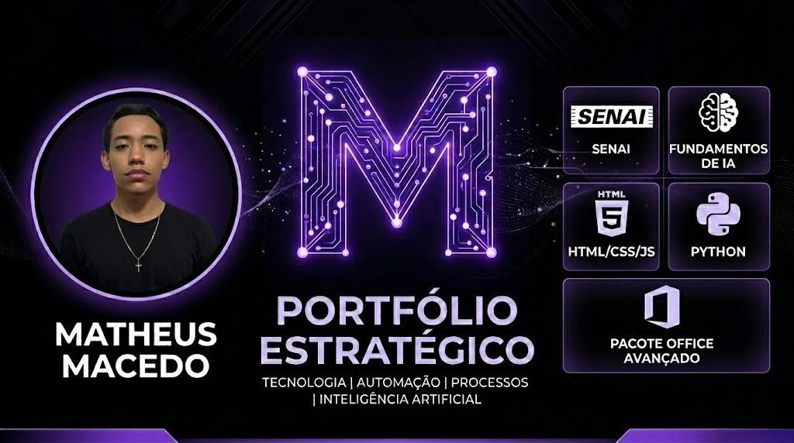

# Olá, eu sou o Matheus Macedo! 👋

### 🚀 Sobre mim
Sou estudante de programação apaixonado por tecnologia, computadores e desenvolvimento web. 
Atualmente focado em Tecnologia, Processos Administrativos e Inteligência Artificial.

📍 Jovem Aprendiz em Três Lagoas/MS.

---

### 🛠️ Minhas Skills
- **Linguagens:** HTML, CSS, JavaScript, Python
- **Ferramentas:** Pacote Office Avançado, Azure IA, Git/GitHub
- **Formação:** SENAI (IA), Salesiano (Informática)

[🌐 Acesse meu Portfólio Estratégico](https://theusms67.github.io/portf-lio/)
